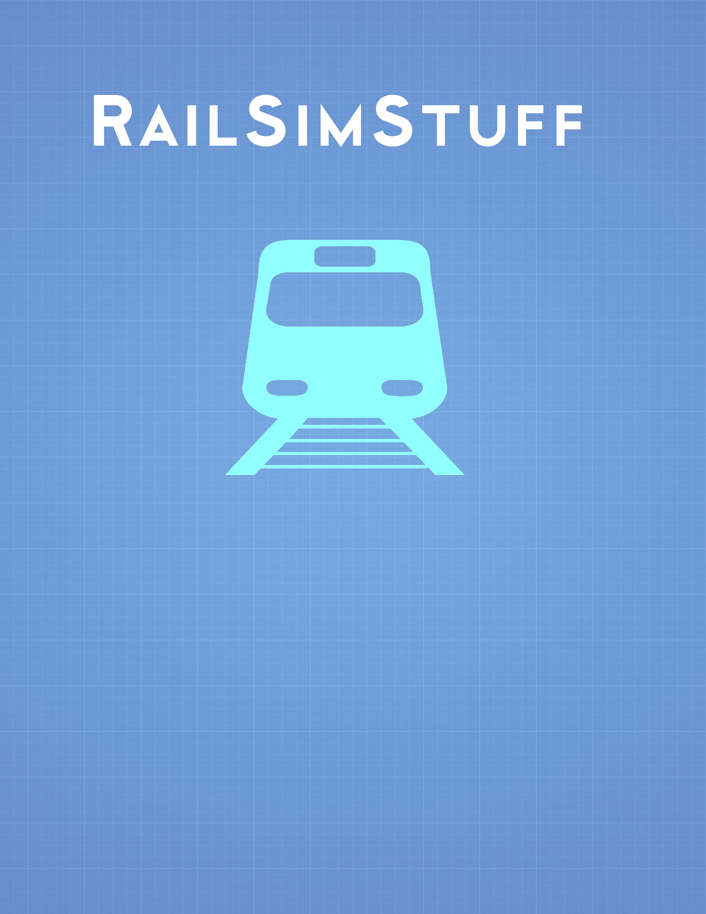

= Open Rails: Blender Content Creation Notebook
:toc:
:toclevels: 3
:sectnums!:
:sectids!:
:chapter-label:
:doctype: book
:author: Pete Willard
:email: petewillard@gmail.com
:homepage: http://www.railsimstuff.com
:revision: 2
:copyright: Copyright © 2020 - 2022
:title-page-background-image: 
:encoding: utf-8
:lang: EN
:experimental:
:icons: font
:pdf-page-size: [8.25in, 10.9in]
:gr: `
:mu: µ
:ohm: Ω
:dot: *
:union: ∩
:degree: °
:C: ©
:arrow: →
:shift:
:bar: |
:bleft: [
:bright: ]
:hash: #
:bslash: \
:BL: {
:BR: }
:sourcedir: code
:source-highlighter: rouge
:OR: Open Rails
:ORTS: Open Rails Train Simulator
:MSTS: Microsoft Train Simulator
:version: Blender 3.3 LTS

<<<
:numbered!:
[colophon]

Open Rails, Blender Content Creator Notebook

{copyright}  {author}  

Lettering:: This book is typeset using the Ubuntu TrueType font

Text Layout:: Ruby - ASCIIDOCTOR-PDF

<<<
== Open Rails, Blender Content Creator Notebook

{copyright}  {author}  

=== Li­cense

This work is li­censed un­der a creative commons attribution-sharealike 4.0 international license

image:images/CC-BY-SA.svg[width=87,height=30]

== About This Document

This is a first attempt at a guide to using Blender with Open Rails for content creation.   For this document, the {version} version of Blender 2.8 should be the minimum release used. Older versions of Blender will not be shown or used. It is recommended to use the latest Long Term Support (LTS) release for maximum compatability with what is shared in this document.

=== About The Author

I am not an expert.  I can best be described as a curious user and occasional content creator. I've been an eternal novice with regards to content creation in general and there are going to be things that I still don't understand sufficiently.

From 2002 until 2016, all of my 3rd party content releases have been for Microsoft Train Simulator using 3DCanvas.  It was ultimately renamed to 3D Crafter and is now effectively abandonded by its creator.

With regards to Blender, I started with versions that were released before version 2.8 and it didn't feel very user-friendly  to me. Due to the unusual and cumbersome nature of the earlier Blender user interface, I also didn't get very far with it.  When version 2.8 arrived, it was still difficult to get started but it was a vast improvement from a user interface point of view.  I don’t think I will switch to a different 3D modeling tool anytime soon. 

=== Contributor and Resources

This document is made possible with the contributions and feedback from people like: 

* Wayne Campbell
* Erick Cantu
* Michelle McKell
* Dave Nelson
* Peter Newell
* Curtis Holt
* Darrin Lile
* Josh Gambrell
* and various Blender add-on authors

Useful resources:

* http://www.elvastower.com
* http://trainsim.com
* http://www.textures.com  You need to login to downloadfootnote:[The site offers Free Registration and free downloads once signed up]
* https://www.blendersecrets.org/   Author of many tips and tricks videos as well as a book
* https://curtisholt.online/    A really good Blender Trainer and add-on creator
* https://blender.org   Where to download Blender from
* https://www.coalstonewcastle.com.au/physics/  ORTS Information
* http://www.nordicfx.net/      HDRI backgrounds
* https://polyhaven.com/  Textures and HDRI Backgrounds
* https://github.com/Stromberg90/Scripts/blob/master/Blender/Edge_To_Curve.py   -Simple but handy script add-on for Pipes and Handrail creation.

<<<<

=== Conventions Used

NOTE: Regular Note.

WARNING: Pay attention to these.

IMPORTANT: You should know this.

CAUTION: With care, you can succeed.

TIP: Optional, but good to know.

`Highlighting`

*BOLD*

_Italic_

----
Source code
----

kbd:[LMB]:: Left Mouse Button
kbd:[MMB]:: Middle Mouse Button
kbd:[RMB]:: Right Mouse Button
_N-Panel_:: Number Panel, kbd:[N] Hotkey in Main 3D Window

Referenced footnotes appear at the end of Chapters

Web Links should be active and will open in your web browser

:numbered!:
[preface]
== Preface

Here is the list of things that I assume about the reader.

* You are new to Blender
* You are reasonably new to content creation for Open Rails
* You have Open Rails installed and working
* You have installed TSRE5 for Consist management
* You have a texture file editor that supports PSD, PNG and DDS formats.footnote:[A good example is the Paint.net, or GIMP which are both free] 
* You have some idea about how Open Rails (and MSTS) content is created
* You have a project in mind, but you understand that you will not create your Magnum Opus on a first try.

If you have prior experience with GMAX, Train Sim Modeler or 3D Canvas, it will be a plus, but it is not required.

=== Organization of This Document

As the title implies, this document is based on a collection of notes I made while learning to make content for {OR}.  As a result, it may not be the most organized or useful document on the subjects discussed within it but it is primarily aimed at filling a void in the available documentation set for {OR}.  This document is FREE and Open Source.  It will ultimately live on in a GITHUB repository created for it.  This means that others are welcome to fork a copy, edit it to add sections or fix errors, if desired.  I,  the author,  do not claim unrealistic ownership of the ideas and concepts contained within.  In fact, I struggle to consider myself the sole author of this manual at this point. Of course, at the moment, I am entirely responsible for its content, but I have created, gathered, reorganized and rephrased the contents as needed since it comes from many different sources. 

Due to the way this document originated, it may seem to jump around and be repetitive at times. My apologies in advance if this bothers you but if you are so inspired, you are welcome to help fixing any errors, problems or omissions.

:sectids!:
:numbered!:
include::makingcontent.adoc[]
include::makingthemesh.adoc[]

