== Making Content for {OR} 
 
  
About ORTS:: The Open Rails Train Simulator is an open source project that exists primarily because the promised Microsoft Train Simulator 2 never happened. {OR} strives to be backwardly compatible with nearly all existing MSTS content while adding many new features and corrects old issues that existed in the Microsoft/Kuju releases.  Very often, you can use MSTS and ORTS terms interchangeably, but keep in mind that ORTS can handle higher poly count (more complex) models than MSTS can as well as having many other changes added that are unique to {OR}. 

[NOTE]
The key advantage that Open Rails currently offers over Microsoft Train Simulator is that good frame rates can be maintained with a much higher number of polygons, so curves can be smoother and more detail can be modelled. Open Rails also displays 32-bit color (whereas Microsoft Train Simulator is limited to 16-bit). Another advantage is the longer viewing distances, adjustable from 2km out to 10km. -- _from OpenRails.org website_

Since this document will be about using Blender, other 3d modeling tools will not be mentioned much unless it's for a point of contrast.

<<<<

=== Common Terms and Definitions

ALPHA:: A bit map with a portion of the image that is masked-out, making the location appear see-though in the image.

MESH::  A 3D Model "shape" made up of 1 or more "faces" without texture

FACE::  A surface created by 3 or more vertices.

VERTEX::    (Plural = vertices ) a point in 3d space with x,y,z coordinates, often used as part of a location where edges and faces meet.  

EDGE::  A line created by the linking of 2 vertices ( known as a "2-dimensional object")

OBJECT::  A 2-dimensional object has length and height, but no depth. Examples of 2D objects are planes, polygons and lines. A 3-dimensional object has length, height, and depth. Examples of 3D objects are cubes and spheres.

POLY COUNT::  The "poly count" is a total of the number of "polygons" used to create a 3d mesh. A polygon is made up of vertices. It is used as an indicator of how complex a model is.

POLYGON::    Refers to the planar face of this closed shape, edges are the straight edges that define it, and points/vertices are where those various edges connect with one another. Blender calls these "tris", short for faces made of triangles and "quads", short for 4 vertex faces. 

TRI::   Faces made up of 3 vertices, also referred to as triangles

QUAD::  Faces made up of 4 vertices

NGON::  Is a face with 5 or more vertices. Many Blender tools and features rely on the underlying mesh to be made of NGONS and will not work with triangulated faces.

HARD SURFACE MODELING:: A generalized term for modeling objects that represent things like vehicles, buildings, weapons, roads. These make use of the more standard mesh techniques and objects like cube, cylinder, plane, cone, torus etc.

NORMAL:: A Normal is a vector in 3D-space that is perpendicular to two other vectors (determined by two edges of a face)footnote:[See Wiki https://en.wikipedia.org/wiki/Normal_(geometry) ] A Normal controls the facing direction of applied textures.

ORGANIC MODELING:: Modeling techniques that use a more sculpted approach for things like animals, people, plants, trees, and even automobiles. There are specialized modeling tools and techniques for this including _SURFACE NURBS_ (Non-uniform rational basis spline, Google it ) and the Sculpting tab in Blender. Blender's Sculpting modes are used for organic modeling and will not be discussed in this document.

UV::    UV is the 3D modeling process of projecting a 2D image to a 3D model's surface for texture mapping. The letters "U" and "V" denote the axes of the 2D texture because "X", "Y", and "Z" are already used to denote the axes of the 3D object in model space, while "W" (in addition to XYZ) is used in calculating quaternion rotations, a common operation in computer graphics.

MANIFOLD SHAPE::   A manifold shape is a 3d object that considered to be water tight.  The vertices, faces and edges are aligned and connected in such a way that if you poured water into to the INSIDE of the object, none would leak out.  A default `cube` primitive is an example a manifold shape. 

ENG FILE:: A file that describes to the Simulator the details of an Asset to be used as an ENGINE within {OR}. It contains physical details such as Motive and Braking values as well as Coupler type, etc.  

SHAPE:: A three dimensional object that is finished in all aspects and ready to be placed within the game environment.

ORIGIN:: See Pivot Point

PIVOT POINT:: A position used to align the shape to its environment, also known as its origin.

HIERARCHY:: The assignment of parenting of objects within a shape so that an objects children will only move when they do but they can move independently too but are always affected by their parent.

MATERIAL:: A material is assigned a texture with additional components such as lighting palette and shading.

SMOOTHING:: A smoothing group is a shade value that allows individual polygons to be lit by the game environment in different ways.

DISTANCE LEVELS:: A range of shapes originating from the one main shape allowing polygon count to be kept low at further viewing distances.  Often referred to as Level of Detail, or LOD.

LEVEL OF DETAIL:: (LOD) Distance values at which the base model is replaced by reduced poly count shapes to account for the inability to see details at a distance.  Higher values should have less detailed models.  There are no hard rules about LOD ranges, but you should try to use them.

WAG FILE:: A file that describes to the Simulator the details of an Asset to be used as an WAGON within {OR}. It contains physical details such as Braking values as well as Coupler type, etc.  

HDRI:: HDRI is short for High Dynamic Range Image. Digital cameras only have a limited dynamic range — that's why some areas of a photo appear darker than they do in real life. HDRIs give photo editors a chance to brighten the corners and create an image that looks more natural.  Environment maps or HDRI maps are one of the most efficient and quickest way to light your 3D scene and achieve realistic results in Blender. HDRIs are essentially a snapshot of the the real world lighting which contain accurate lighting detail through high dynamic range imaging (HDRI)

=== Content Generation Involves:
 
* A mesh - Your 3D model
* Online resources and references (This is an area that is somewhat lacking with regards to 3D modeling for ORTS, but these include https://msts.steam4me.net/tutorials/index.html https://www.trainsim.com/vbts/forum.php and http://www.elvastower.com/forums/index.php )
* A texture - A 2-dimensional bitmap image (material) that you will apply to your model, also referred to as a 'skin'
* A UVmap of the mesh - The instructions on how to map your 2-dimensional texture to your 3d model 
* A configuration file or set of files that describes your content to the simulator
* A thumbnail jpg (optional but helpful)
* Instructions - Let's not leave the work half done

=== Programs you should have:

* A 3D program, {version}
* An Exporter add-on for the MSTS/ORTS format, we will use Wayne Campbell's _S File Exporter_ from Elvas Tower web sitefootnote:[Download from https://drive.google.com/file/d/1Oykl70glvaFU1t4dqwSrl8vgMFdI-kMb/view?usp=sharing]
* A paint program that has channels and layers (There are multiple options here)
* A text editor that handles UNICODE files

NOTE: If you are also making models for Trainz Simulator, note that the latest versions of Trainz will accept the native Blender FBX exporter file output. 

=== What I use:

* 3d Modeler: {version}
* Bitmap tool (any one of these, interchangeably): Serif Affinity Photo, Serif Affinity Designer, PaintShopPro Version 7, Paint.net or Photoshop CS2
* UV/Shader tool: Blender has this  built in, but 3rd party options exist
* Text Editor: _Microsoft Visual Studio Code_ 
* Metric Conversion Calculator (I have one built into hand held calculator, but you can use Google for this)
* A Scale Calculator: Converting dimensions from a scale drawing. (there is on on my website at http://www.railsimstuff.com ) 
* A texture snipping tool, a) Windows has a built in Snipping tool, b) SHOEBOX, an Adobe Air Application, designed for use with game creation.

====  Why I Use Blender 

In 2002, I started using 3D Software to create content for games, primarily for {MSTS}, and I have worked with different tools on different projects and in the end I found Blender to now be my personal favorite. I have used Abacus Train Sim Modeler, 3D Canvas, Gmax and Sketchup and while 3D Canvas was my favorite for many years, my use of it now is only as a file format conversion tool. {version} has everything I need to be making 3D models and includes many things that 3D Canvas doesn't have, including active technical support.  

==== Why You Should Use Blender

Blender is free. With the open community supporting Blender as well as there being a large collection of handy addons, it gives you a wide range of possibilities to customize your Blender workspace and workflow.  While some add-ons are not free, most are reasonably affordable, with some paid add-ons on sale as low as $1.  

To export your model for using in MSTS or ORTS, Wayne Campbell created a very capable exporter for MSTS format `.s` files.

=== What I Can Recommend:

* 3D Modeler: Blender 2.93 LTS version or {version} (if you are already well accustomed to Blender 2.79 it's OK, but you will be on your own here) Did I mention that it is free?
* BitMap Tools: Serif Affinity Photo, _Photoshop CS2_ (You can still get this for free from Adobe if you google for it) , _Paint.net_ (free), _PaintShop Pro_ (even version 7 still works), or download the latest version of GIMP for free.
* UV tool: While there are 3rd party options for this, you can just use UV and shader tools that come with Blender (You could look at Meshmixer or even SubstancePainter)
* Text Editor: _Microsoft Visual Studio Code_ or _Context.exe_  

[NOTE] 
CONTEXT is an abandoned editor, but it has a syntax highlighter for ENG and WAG configuration files available at steam4me.com website. There is an early version of a context highlighter in the works for ENG/WAG files in VScode, but I've not finished it yet.  https://github.com/pwillard/engwag

=== How to Install Blender

According to the Blender.org website, a new version is released about once per quarter.  I'm going to assume you are installing Blender on a Windows 64 BIT platform.  I would recommend that you download the `LTS` or Long Term Support version and if you are really brave, you can download the latest available stable version. 

[TIP]
While Blender CAN run from a USB stick in a portable mode, it's best to just use the MSI installer.

[WARNING]
If you are still using Windows 7, you won't be able to install a Blender version 2.93 or newer.  You really should upgrade.

[WARNING]
If you install Blender for FREE from STEAM, the STEAM Library interface will auto-update to the latest version of Blender for you by default.  You may not like this behavior so you are warned.

[NOTE]
Between each version update, the Blender developers might move some user interface features around a bit.  You might not see the same screens shown in the examples included in this document.

Let's use the Blender installer from the *Blender.org* website. https://Blender.org/download/

The LTS version will be a link on the page referred to on the "Looking for Long-Term Support? Get {version}".  It can be found here:  https://www.Blender.org/download/lts

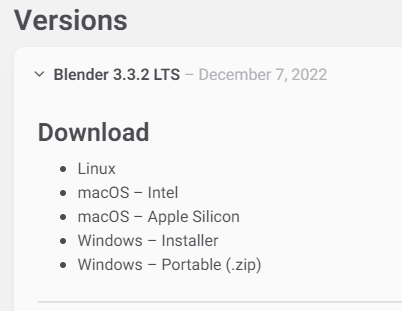

Hopefully, Blender.org will continue its practice of creating LTS releases.

From here you see various download options available. Locate the `Installer` option and download it.  Double-clicking the downloaded `.MSI` file will begin the install. The `.MSI` file does all the work.

[NOTE]
Blender will default to using your `DOCUMENTS` folder for Models and your `%APPDATA%` folder to store program configuration data and addons under the "Blender Foundation" folder structure.  Blender will use unique entries for each version of Blender installed so it is perfectly fine to have multiple versions of Blender installed on the same PC. (It does get tricky related to the File Associations pertaining to which version of Blender will open when you click on a .Blend file. The default will become whichever version of Blender you most recently installed.  Be warned that you might need to tweak this)

[TIP]
The APPDATA folder is normally a hidden folder in your windows File Explorer.  You can reach the folder from a command prompt by typing `cd %appdata%`. You can also modify your File Explorer settings to not HIDE folders from you by changing the settings under menu:View[Options > View > Show hidden files, folders and drives].

According to Windows POWERSHELL on *my system*, the %APPDATA% Environment variable points to: 

----
PS C:\Users\willard> $env:APPDATA
C:\Users\willard\AppData\Roaming
----

This means that Blender USER DATA such as User Preferences, Default Startup Blend Files and 3rd Party Add-Ons will be stored in the `Blender Foundation` folder under 

`C:\Users\willard\AppData\Roaming\` + 

in other words, my config files and addons are located at + 

`C:\Users\willard\AppData\Roaming\Blender Foundation\Blender\3.3\config`   

Below is an old video link, but you will get the general idea of how to install and initially configure Blender...  These steps are also contained below.

Video Link: https://youtu.be/ad4vTwCGodo

<<<<

=== Setting up our Blender Environment

There are some post installation steps we will follow to customize Blender for the kind of work we will be doing.  We will start on the main one-time setup splash screen where we will make one change.  We will change the kbd:[SPACEBAR] key to perform a `SEARCH` instead of `PLAY ANIMATION`.

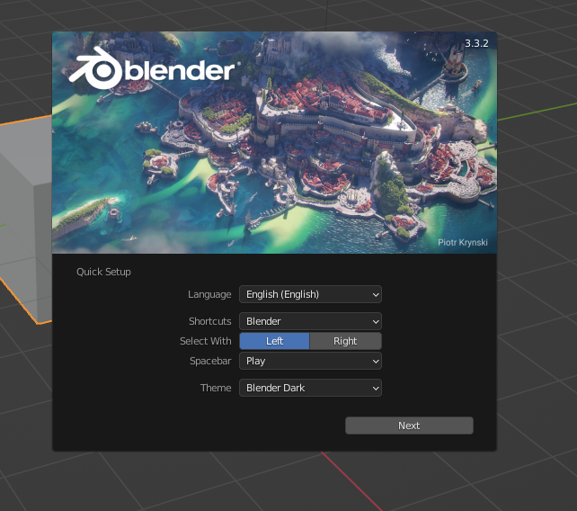

[NOTE]
You will only see this screen when your "User Preferences" file doesn't exist yet, so you won't see it again unless you do a fresh installation or you choose to delete the USER PREFERENCES file. +  
`%appdata%\Blender Foundation\Blender\3.3\config\userpref.blend`

Next, we will go through the steps of customizing our PREFERENCES settings.  These are located under the menu:EDIT[PREFERENCES] menu pull-down on the top bar. (Look for the Gear Icon)

<<<<

==== Interface

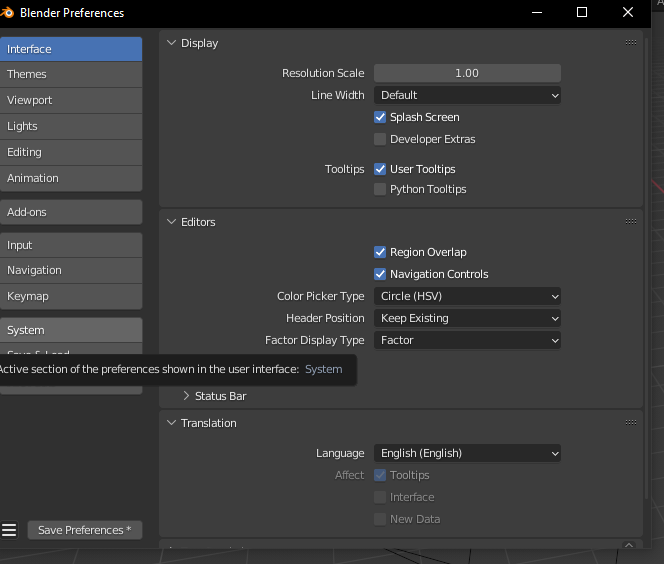

In this screen, you might want to adjust the `Resolution Scale` to get the most readable text size based on your monitor's resolution.  You can use the mouse to slide that value left or right to adjust the screen content size.

I would also consider unchecking the "Splash Screen" option as once you see it a few times... you realize that you don't need to see it.

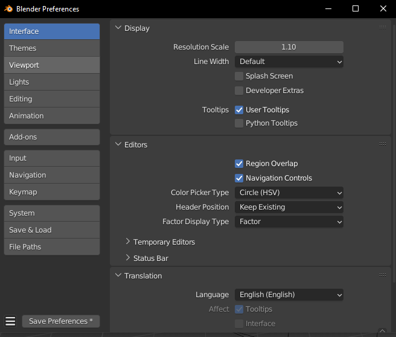

Screen with options changed to what I prefer...

<<<<

==== Themes-3D Viewport

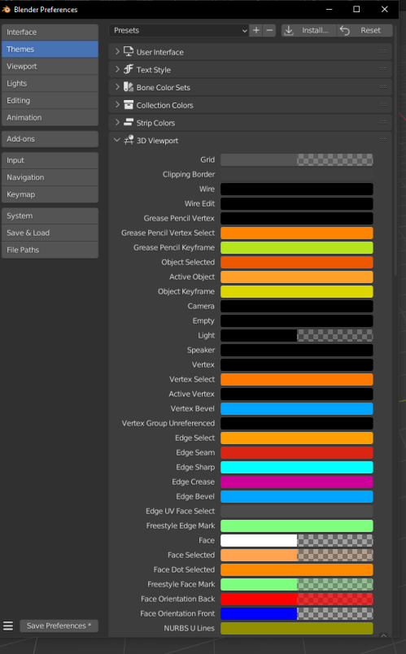

In the menu:THEMES[3D VIEWPORT] section,  a common practice is to adjust Face Orientation Alpha setting (currently BLUE)- By adjusting the alpha setting to the LEFT, the BLUE will no longer show for outside facing Normals, but will still show RED for inside facing Normals.   The BLUE is a bit jarring when the "FACE ORIENTATION" setting is enabled.  Change the Alpha value for the Blue to 0.

At the bottom of this menu, you can adjust the VERTEX sizes to make them more visible by changing them from the default of 3 to a value of 5. If your screen resolution is high, making the vertex size 5 or 7 can help with visibility.

==== Viewport

For better render results, you might want to adjust these values in the menu:VIEWPORT[QUALITY] section:

* SAMPLES = 16

In the menu:VIEWPORT[TEXTURES] section:

* ANISOTRIPIC = 4x

You can also adjust the 3D Viewport Axis to a smaller X,Y,Z line reference (change to Simple Axis) if you don't like the big navigation gizmo.

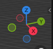

<<<<

==== System

image::images/PREFS4.PNG[align=center]

In the menu:SYSTEM[CYCLES RENDER TAB] section:

* Adjust CUDA settings to use both CPU and GPU - if possible.

In the menu:SYSTEM[MEMORY & LIMITS] section, 

* Change UNDO steps to 200 or higher. I believe that 254 is the maximum value though. The default is only 32 undo steps, which isn't much.

<<<<

==== Save & Load

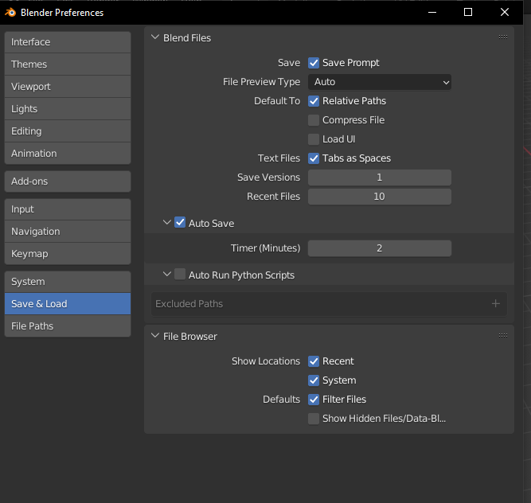

In the menu:SAVE & LOAD[BLEND FILES] section:

Consider unchecking the `Load UI` option.  When this is checked, the User Interface settings come from the .Blend file that was opened and not the normal User Interface you have setup for new .Blend files as your default.  This is especially troublesome, if left enabled, when you import someone else's .Blend file, as the user interface could be very different from what you normally use.  Change this as needed, but you should know how to include (or not include) the User Interface settings when loading .Blend files.

[TIP]
I believe that you would want to  RE-ENABLE this option if you have .Blend files that are using millimeters, common settings for 3D Printing model files, so that you would maintain proper UNITS settings when working on smaller objects.

I would also adjust the "SAVE VERSIONS" option to allow for automatic backup copies of the current .Blend file to be created.

==== File Paths

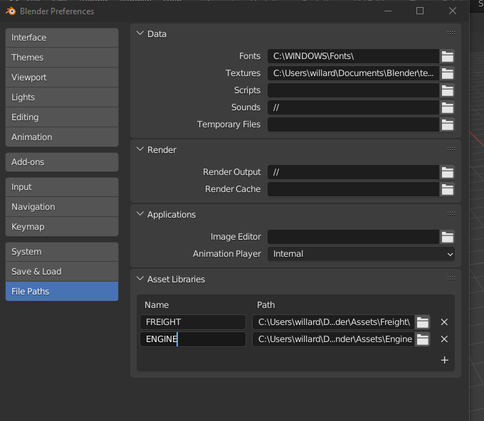

Blender relies on a number of default or user-defined file locations for certain things like FONTS, TEXTURES, TEMPORARY files, etc... this is where these settings can be changed. Many of these locations default to your standard "DOCUMENTS" folder on Windows.

In the menu:FILE PATHS[DATA] section:

* I usually define a common "textures" location for my 'library' objects, items that I share across multiple models.  %USERPROFILE%/DOCUMENTS/Blender/TEXTURES, for example.
* The SCRIPTS location is where you would place your Blender Python Scripts (There is one we may need to use that we will discuss in another section of this document)

`The next section applies only if you have installed Blender version 3.0 or newer.`

In the menu:FILE PATHS[Asset Libraries] section:

* This setting will default to  %USERPROFILE%/DOCUMENTS/Blender/ASSETS
* If you would like to have multiple ASSET library sections, you would btn:[RMB] the btn:[+] symbol on the bottom right of the "Asset Libraries" window to add a new ASSET Folder(s) to the list.

You will see that I have renamed the default "user" location's name to be "FREIGHT" and changed the folder location it references and I also added an additional library folder for ENGINE related library objects.

[NOTE]
Asset Library files are .Blend files with 1 or more objects in them that are specifically *marked* as ASSET OBJECTS.  This will make them show up in the Asset Browser window. Objects in the .Blend files that are NOT marked as asset objects will not be seen and will not be available as Asset Library Objects.

To see the Asset Library while you are editing 3D models, using the "Layout" tab at the top of the screen you will see the Animation Window at the bottom. We will replace this window with the Asset Browser window by clicking the small "clock" pulldown menu next to the PLAYBACK tab of the Animation window and then select the "Asset Browser" item from this menu.

Resize the Asset Browser window by pulling up on the top of the Asset Browser window when the cursor changes to double arrows.  This will allow you to better see the Asset Browser's available objects. For example:

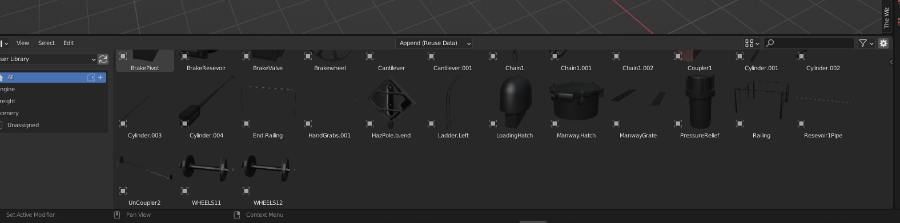

Various libraries can be selected using the menu options on the  left.

<<<<

==== Add-Ons

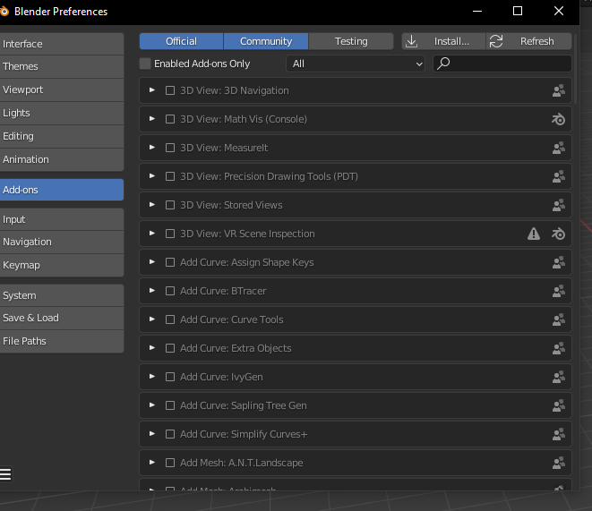

In the menu:ADD-ONS[OFFICIAL + COMMUNITY] section:

The Add-ons section lets you manage secondary scripts, called “Add-ons” that extend Blender's functionality. In this section you can search, install, enable and disable Add-ons. Blender comes with some useful Add-ons built-in that are ready to be enabled. You can also develop and add your own, or install any of the ones you might find on the web.

Blender’s add-ons are split into two groups depending on who writes or supports them:

Official:: Add-ons that are written by Blender developers.
Community:: Add-ons that are written by people in the Blender community.

===== Enabling and Disabling Add-Ons

Enable and disable an add-on by checking or unchecking the check-box of the add-on you have selected. Add-ons are immediately available when checked, or disabled when unchecked.

To locate a built-in add-on, use the search option and then use the check-box to enable it.

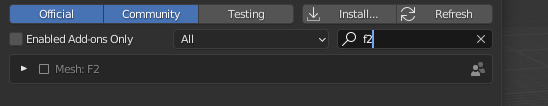

Add-ons are grouped by their TYPE, such as MESH, IMPORT_EXPORT, CURVE, etc. 

To get us started, here are a few built in Add-ons I recommend installing:

[TIP]
(When searching, use the word on the right (see below),for example type; `F2` to locate the built-in or already installed addons)

* MESH: `LoopTools`
* MESH: `F2` 
* MESH: `Edit Mesh Tools`
* NODE: `Node Wrangler`
* ADD CURVE: `Extra Objects`
* ADD MESH: `Extra Objects` 
* MESH: `Automirror` - Super-fast cutting and mirroring of mesh

Loop Tools:: This and EDIT MODE addon that has a lot of operators for turning any number of edges into a circle or curve, It can bridge edge loops *and* add segments while doing it, it can turn sloppy loops into a perfect curve, it can flatten things at graduated angles unlike using kbd:[S] kbd:[X] kbd:[0].... It can TWIST things... It has a cool LOFT option (PLAY WITH IT) and finally, it can average out the distance between a series of vertices using the SPACE option. When in EDIT MODE, it will show up on the right side N-Panel menu under the `EDIT` tab or in the kbd:[RMB] menu.

F2:: A quick FACE creation (filling holes) add on to save keystrokes when manually adding faces, especially in repetitive face creation. It used the kbd:[F] key.

Edit Mesh Tools::  Another EDIT MODE addon tool and, like Loop Tools, it has a right side N-Panel menu and a kbd:[RMB] menu. It has sections that deal with vertices, faces, and edges. It has some features that require multiple steps to do normally.  The menu options are pretty self explanatory, so its worth doing some experiments to see how its features can be helpful. Some of the best features are related to face manipulations.

Node Wrangler:: This add-on gives you several tools that help you work with nodes quickly and efficiently.  kbd:[CTRL-SPACE] for general menu, kbd:[CTRL-T] for texture and UV Mapping nodes, kbd:[CTRL-SHIFT-T] for PBR Texture nodes, kbd:[CTRL-SHIFT-LMB] to isolate a texture, kbd:[ALT-RMB] for Mixed Shader nodes, and kbd:[CTRL-RMB] for quick links.

ADD CURVE: `Extra Objects`:: Will add a number of additional Curve Object Primitives, such as Arc, Arrow, Cogwheel, Cycloid, Flower, Helix, Noise, N-sided, Profile, Rectangle, Splat and Star, some various knots, and additional variants of available primitives.

ADD MESH: `Extra Objects`:: Will add a number of additional Mesh Object Primitives, such as five types of beams with Beam Builder, gears, honeycomb, diamonds, pipe joints, stars, some additional shapes similar to the Suzanne Monkey head, Add a single vertex, and wall builders. 

Automirror:: A quick and easy object mirroring tool with multiple options. A bit simpler than the Mirror Modifier. 

===== 3rd Party Add-Ons

We will initially start with some freely available 3rd Party add-ons that we will want to have, including one optional one if you plan to model for Dovetail Games Train Simulator.

[cols="1,3,3"]
|===
| Add-on	| Where to gert it	| What it does

| Blender28toMSTS |Available From: http://www.elvastower.com/forums/index.php?/topic/33247-Blender-28-to-msts-exporter/| S file Export (MSTS ORTS - V4.3)  See the video:footnote:[Youtube https://youtu.be/j3AVw7s9qoA] Instructions say to un-zip the the file before using the Blender `install` option, as it won't install correctly due to the additional support files included with the distibuted `.zip` file.
|Edge to Curve | Available From: https://github.com/Stromberg90/Scripts/blob/master/Blender/Edge_To_Curve.py | A python script to create "Curves shapes from Edges" that can be converted back to a mesh.  It can be used to create handrails and pipes. 
| Optional: Briage28 | Available From: http://jujumatic.free.fr/Files/BRIAGE_G//BRIAGE_G_2.83Pckg_3-1-412.7z  | Train/Rail Simulator Export if you also have this simulator (Dovetail Games) 
|===

Note: These are free but some of the add-ons that we might want to install later might be paid add-ons.

There are hundreds of add-ons that are not distributed with Blender and are developed by others. To add them to the list of availble add-ons, they must be installed into Blender.

To install these, choose the btn:[Install…] button and use the `File Browser` to select the `.zip` or `.py` add-on file.

You will then have the option to enable to disable the installed add-on using the check-box.

==== Exit and Save Preferences

Exiting (closing) the menu:EDIT[PREFERENCES] section will save your changes. By default, it automatically saves your changes unless you have unchecked `Autosave Preferences` in the _hambuger_ menu at the bottom of the *Preferences* window.

<<<

=== Other Settings

We will continue making changes to the header and properties panels near the top and right side of the screen respectively. Some. if not all, of these changes are purely optional but they are worth checking out.

==== Scene Settings

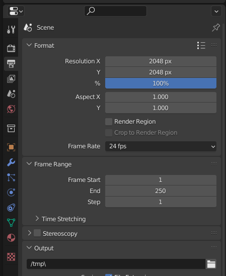

Define your default output resolution as 2048x2048 since we will generally be working with square textures.

====  GIZMO settings

In the Layout window there is the GIZMOS Drop Down menu. (Look for an arc with an arrow icon) You can enable the MOVE option with a check-box.  This will give you AXIS based MOVE arrows that you can grab to assist with moveing an object around your scene. (Or you can just use the "G" key options.)

==== Overlays

Right next to the GIZMO options, there is an icon for OVERLAYS.

Under Overlays (Select the default cube and change to `EDIT MODE` using kbd:[TAB]. If there is no default cube, then use menu:Add[Mesh > Cube] to place a cube in the scene and go to EDIT mode using kbd:[TAB].)  In the `OVERLAYS` drop down, enable the `EDGE LENGTH` check-box.  This will show the actual edge unit lengths of selected objects when you have and edge or edges selected. 

==== Shading Settings  

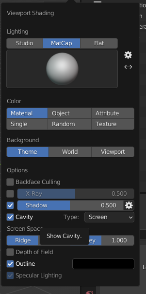

* Under SOLID VIEWPORT SHADING (Locate the Solid Circle Icon and use pulldown on the right of it), change the following:
** Enable the check-box next to Shadow
** Enable the check-box next to Cavity +

These steps help to make things more visible while editing.

I also choose MATCAP and pick the leftmost MAPCAP option for better visual representation of what I'm working on in the early stages of modeling.

<<<<

==== Units

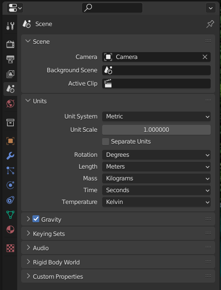

If you need to work in Imperial Units versus Metric, you adjust the setting under the UNITS SYSTEM option in Scene Properties. 

<<<<

==== Scene (Rendering)

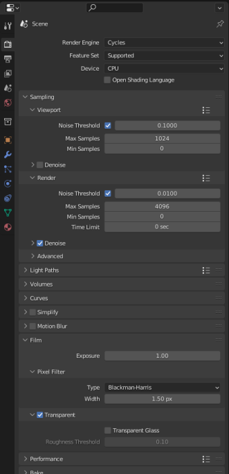

The settings here are optional but give better render results.

menu:Properties Panels[Scene>Render Engine > Eevee]  and modify SAMPLING > RENDER option to 200 SAMPLES

menu:Properties Panels[Scene>Render Engine > Cycles] and modify SAMPLING > RENDER option to 200 SAMPLES

menu:Properties Panels[Scene > Film] In the Film section,  Enable the check-box for "Transparent"	(This removes any background from renders, you *will* want this)

==== Shading

Related to the `Shading` Tab on the Top Bar Menu, we will make some adjustments for lighting.  Rather than rely on actual `light` objects in our scene, we can create general illumination effects based on HDRI images. 

This step requires that you have already downloaded an example HDRI file from one of the HDRI WEB SITE locations mentioned at the beginning of this document.  The downloaded HDRI files should be located in your menu:Documents[Blender > HDRI] folder that you create for this purpose.  See TIPS below for what I am using.

In the "World Properties" panel (globe icon on the right),  Add "Background" in the Surface pulldown menu.  In the Color section, select "Environment Texture". This will allow us to chose the HDRI we downloaded and made available for Blender to use.   Select the "Open" button and choose the HDRI file you want to use using the "File Browser".

Now, when you chose Render, you will be using the lighting from the HDRI file. 

If you now select the `Shading` tab and then choose the `Viewport Shading` view icon (The one to the right of Solid Shading Icon) you would then choose the pulldown on the right (viewport shading) and then adjust the default lighting setting to `Scene World`.   You will now see your work with the new HDRI background in place.

When you now Render your model, this would be your background if you had not chosen "transparent" in the FILM option earlier. 

[TIP]
I have used the `Abandoned Slipway` HDRI from https://hdrihaven.com as recommended by *Josh Gambrell* for neutral outdoor lighting in the past. Currently though, I am using a file called `hdri_004_nordicfxnet.hdr` aka "Railroad Crossing" from  http://www.nordicfx.net/  as it seemed more appropriate.  I did scale it down from 4K to 2K though.

[TIP]
There is a free HDRI addon that makes setting up the World HDRI lighting image files a bit easier called "EASY HDRI". Totally optional of course.

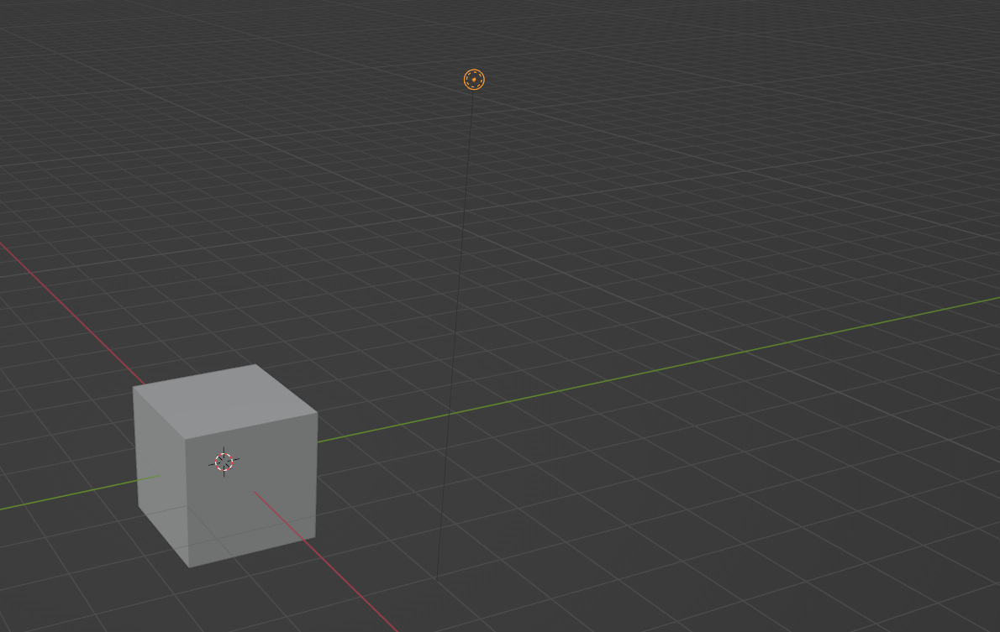

The last thing we need to do now that we have replaced how we do our lighting for renders is to delete the default light source in the default file.  In the Scene Collection, or in the main 3d Window select and delete the default "light" object.

<<<<

=== Done, for now

One last step... +

Press the kbd:[N] key to bring out the `Number Panel` where you can adjust objects settings and locations by entering numbers. This will have the number panel available when we start new Blender projects.

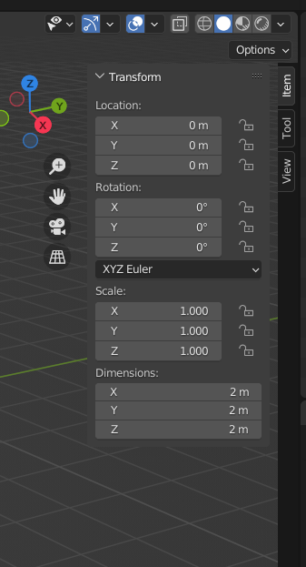

With these changes done, its time to save our settings.

menu:FILE[DEFAULTS > SAVE STARTUP FILE > Confirm]

We will now have all of our basic user preferences and startup file options the way we want them for 3D modeling simulator assets.

<<<

== Folder structure

The layout of your project development folder is completely personal depending on how you organize your work.  I'll share what I currently use as an example.

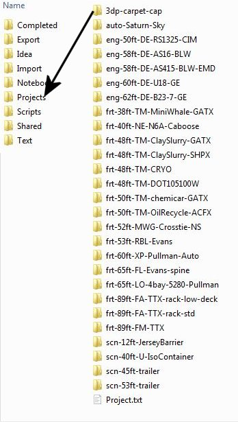

[NOTE]
I snipped a lot of details out for brevity and left some in as examples.  EXPORT is for renders and such, IMPORT is for things I'm converting from 3DCANVAS and TSM. PROJECTS, should be obvious, but I use prefixes and a naming standard to make things easy to find. I use  a SHARED folder for things that all projects will share, like Asset Libraries and common textures.  I prefix my Freight cars with FRT, Scenery with SCN and Engines with ENG... you get the idea.

<<<

== Content Creation Overview

The information presented below is not specifically about modeling with Blender, it is about how to create items that comply with the simulator requirements and guidelines.  Some references to my old 3DC notes are included here.

[TIP]
Reminder, this is basically a "notebook" and started life as my collection of content creation files.  It may seem to jump around a lot as a reult.

=== Orientation

There is a requirement to properly orient your model if you are making rolling stock or an engine.  If you have used 3D modeling software in the past, maybe 3D Crafter/ 3D Canvas or Maya you might be accustomed to Z axis being DEPTH and the X axis being WIDTH and Y axis being HEIGHT.  Blender orientation is similar to 3DS MAX where Z is HEIGHT, X is WIDTH and Y is DEPTH.

When working on things that roll on the track, the FRONT of a model is aimed towards the Positive values of the Y axis and the REAR of the model faces the negative Y axis. 

[WARNING]
Blender's point of view differs slightly in that it considers the FRONT to be facing the -Y direction.

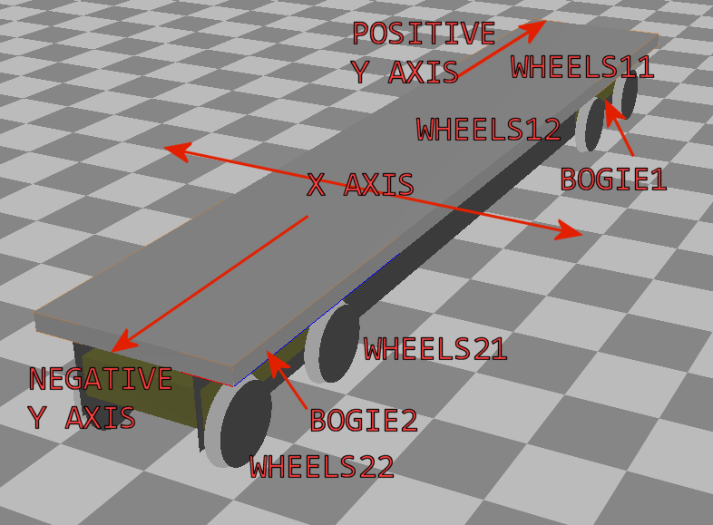

=== Engine/Wagon Model Hierarchy

For a model to work correctly in {OR}, there are some requirements that need to be met if you want to have the simulator properly automate animations for wheels and bogies.  For simplicity, I am implying that the A-END of the boxcar is on the right and the B-END (with Brakes) is on the left.  The Boxcar's default direction of travel in this case then would be this way, ->, or from Left to Right.  (Refer to `ORIENTATION` section above)

image:images/heir.png[]

[TIP]
The way I have found to get the correct layout of a dual 2 axle `BOGIE` `WHEEL` arrangement is to have all wheels use the center of their axle as the pivot point and the bogie use its default center of mass as its pivot point. In general, all other parts in a model will use world origin as the pivot point.  

[NOTE]
The Main body part does not need to be called MAIN. Modelers have been using that as a convention since 2002 so it has become a standard thing to do but it's not a requirement for {OR}. The Blender `S` file exporter by Wayne Campbell only requires that you use `MAIN` as the name of the `COLLECTION` that refers to where your model objects reside.

[WARNING]
Be careful with selecting all objects in object mode and then applying "all transformations", as it will reset all objects to have their origin (pivot point) to be `world origin`. This would change the pivot points of the bogies and wheels.

=== Standard 2 Axle Freight Bogies
If you are looking at the model from the Left Side View, the forward direction of the model is facing right.  Starting at the right, the bogies and wheels are named according to the diagram above, where associated WHEELS parented to the related BOGIE1 or BOGIE2. 

If an additional axle is needed, use WHEELS13 or 23 located behind the bogie pivot relative to forward motion and shift wheel set 2 to the center of the related BOGIE. Its is important that the naming sequence remains (11 to 23) as shown in the diagram or wheels will turn backward and shift improperly in MSTS. 

[NOTE] 
You would not have a 2 axle BOGIE with WHEELS13 or WHEELS23.

=== Isolated Axles

The MSTS naming standard for isolated axles with non-bogie wheels, is  WHEEL1, WHEEL2, WHEEL3.

NOTE: These are primarily used for STEAM locomotives. Animating these wheels is not automatic and must be done using the animation tools within Blender.  The Steam wheel and linkage animation uses a series of 16 frames.  In general, it's non-trivial to to create this animation and I won't be covering it in this document.  (unless someone provides us with good notes about how it is done)

In ORTS, it appears that only the WHEEL and BOGIE prefix is required.

[WARNING]
Some MSTS documentation leads you to believe that a third bogie is possible in MSTS - it isn't.  However, if you are modeling specifically for {or}, then you should know that the simulator will properly animate anything with the correct BOGIE and WHEEL prefixes as long as you follow the guidelines for parenting and local pivot origins.

Microsoft recommended the following topology for the Acela as an example:

----
MAIN ENGINE	
PANTOGRAPHTOP1				
		PANTOGRAPHBOTTOM1			
	PANTOGRAPHTOP2					
		PANTOGRAPHBOTTOM2
	BOGIE1	
		WHEELS11
		WHEELS12
	BOGIE2	
		WHEELS21
		WHEELS22
	MIRRORRIGHT1	
	MIRRORLEFT1
	WIPERARMLEFT1
		WIPERBLADELEFT1
	WIPERARMRIGHT1
		WIPERBLADERIGHT1
----

=== Configuration Files

Models of rolling stock and signals can take advantage of a few features which are only available in Open Rails and not MSTS.  Having a good understanding of the new ORTS features, by referring to the {OR} manual, can be helpful in creating more capable and accurate content.  While the current {OR} manual is a bit shy on content creation details, much of the information that is available about Microsoft Train Simulator content creation still applies.

While I'm not going to create a full guide to `sd`, `ref`,`eng` and `wag`  files here in this document, we will need to create a working file if we plan to add content to {OR}.  Peter Newell's website has an in-depth look into creating good `ENG` and `WAG` files for {OR}.footnote:[https://www.coalstonewcastle.com.au/physics/format/]

=== Various General Notes about Content Creation

[.lead]
An interesting discussion occurred in 2017 about making these files better and more useful in the post-Microsoft Train Simulator world. 

[quote, Erick Cantu, 20 November 2017 ]
_____
For better and worse, KUJU defined all of the folder names we use in MSTS. With the development of the Include file concept (as applied to .engs and .wags) I concluded that something very much like KUJU's \common.cab directory tree was needed for .inc files. Using the examples of how payware vendors made use of folders in \trains I saw that sometimes they used \common.cab, sometimes they used a folder specific to their own product folder, and sometimes they used something "in between" -- a vendor named folder named for the unskined mesh (e.g., 3DTrains_FPack).

IMO KUJU's example of a CAB file, you will see a good template for locating the "include" files. After much experimentation I'm proposing am solution that addresses these needs:

* A folder for shared .inc files, much like what is in \common.cab.
Recognition that many end-users have routes and equipment from many countries and therefore it might be useful to group certain files for each country.

* Acceptance that many payware vendors sell the same mesh skinned for many railroads but when distributed they use a unique folder for each railroad.

* Addressing the easiest to solve problems with minimal commonality, where everything belongs in one folder.
_____

<<<

Proposal:
Within the `\trains` directory,

Add `\common.fleet`

and 

Add `\common.model`

Within both of those directories, add folders (one for your own country and others only as needed) for country codes. 

Examples:

----
\AUS Australia
\AUT Austria
\BRA Brazil
\CAN Canada
\CHE Switzerland
\CHN China
\CZE Czechia
\DEU Germany
\FRA France
\GBR United Kingdom
\HRV Croatia
\HUN Hungary
\IND India
\ITA Italy
\JPN Japan
\NLD Netherlands
\POL Poland
\RUS Russian Federation
\SVK Slovakia
\SVN Slovenia
\SWE Sweden
\UKR Ukraine
\USA United States of America
\ZAF South Africa
----

For myself, this means I should strive to have (at least) this format somehow:

`\common.fleet\USA`

and 

`\common.model\USA`

=== General Modelling Standards from Erick Cantu

[WARNING]
I'm not sure how much this applies specifically to MSTS and not {or}

* The top node's pivot should be 2 inches below the rail to ensure that wheels sit on the rails correctly. (Keep in mind that you might need to tweak this for proper ride height)

* Cars should all use consistent bitmap resolution and be designed with a wide variety of systems in mind. This consistency should apply both between cars and between the constituent parts of the cars themselves, including the texture mapping scale. Ideally, triangle counts should be around 12,000 or less at the top LOD, with aggressive optimization of vertex counts through the limiting of hard edges and careful welding of UV coordinates wherever possible.

* Part of this consistency will be making the cars look good together, which means consistent air hose heights. I am willing to supply sample cars that can also be cannibalized for parts. If compatibility with all of the cars I am building is a goal, then the tips of brake lines should be 14.5" above the rail, extended to a position where it will meet the air hose on the next car, and held in place the way most are in the real world, with a chain or cable (I use a simple cable shape).

* Couplers going through other couplers are the worst, so it's probably best to have them as either part of the truck mesh (which is what Erick Cantu of NAVS does) or have them linked to the trucks in the hierarchy. The exception, of course, is cars where the truck centers and couplers are far apart, such as auto-racks, boxcars with end cushioning, and so on. Obviously, the couplers would have much too wide a range of motion through most curves under these circumstances.

* Keeping draw-call counts low is important. Keeping overall texture counts low is even more important. Car bodies should strive to use both a single texture sheet and a single material for that sheet unless there is a need to have more than one material (e.g., for specular roofs on cars with flat sides). We can always place multiple car-bodies in a single sheet if a single square texture is not adequate. This has been NAVS standard practice for freight cars for some time now.

* 1-bit alpha channels are acceptable only when alpha cutouts are perfectly square. Otherwise, use grey scale alpha and antialiased edges.

* The MSTS convention of having the underside of all freight cars be completely devoid of any geometry, leaving the user to see sky when the car is viewed from below. This flies in the face of the fact that bridges are a thing, so this practice is best avoided. Car undersides do not need to be complex, but they should be present.

* Generally, it's wise to use whatever units match your reference materials to avoid unnecessary conversions. For example, when I build a Boeing, I work in decimal inches. When I build an Airbus, I work in decimal meters. For most US stock, reference materials will be in inches.  Its not a rule though.  If you have a scale calculator handy, its not hard to convert Imperial to Metric and visa-versa.

=== General Texture Mapping Guidelines

* All main parts should be mapped to the same resolution, and texture resolution should be consistent with mesh resolution. Navs uses a fixed resolution of 1/2 inch per pixel, meaning every two pixels is an inch.

* To save real estate, use a lower resolution of 1 inch per pixel for car undersides and interiors.

* One of the things that MSTS and OR model builders have traditionally needed improvement on is alignment across edges. You should be able to run a line from the car side to the car end or from the car side to the car top without having a mismatch at the edge. Striping around edges is not uncommon, so this is important.

*Splitting car sides into multiple sections is not recommended, as it adds unnecessary mesh divisions and UV coordinates. It may be necessary for very long cars, such as auto-racks, however, for most cars of 60 feet or less, it's really not necessary if you plan ahead. Using the top half of a texture sheet for one car and the bottom half for another creates a large, rectangular area to work with and allows for multiple cars to use a single texture sheet. Remember, Open Rails is sensitive to both drawCall counts and the total number of images across a train, so putting multiple cars in one texture isn't actually a bad idea.

Microsoft recommended using SQUARE texture shapes that corresponded to a specific evenly sized shapes, like 512x512, 256x256, 128x128, etc.  This limitation no longer applies in {or} and you can reasonably use a 2048x1024 sized file if you desire.
