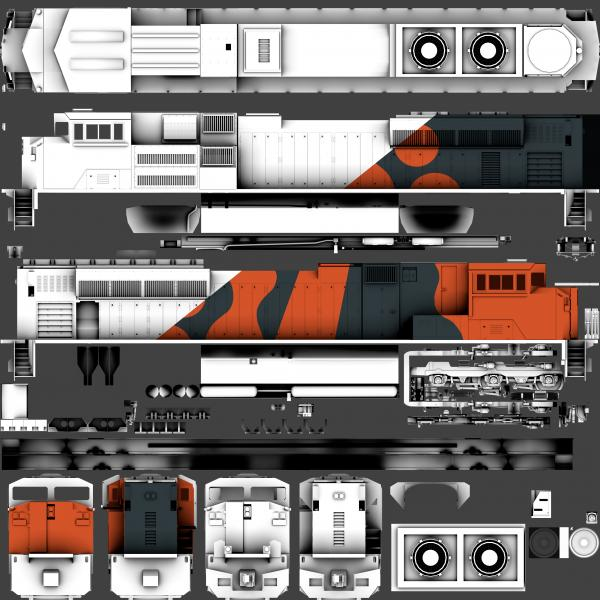
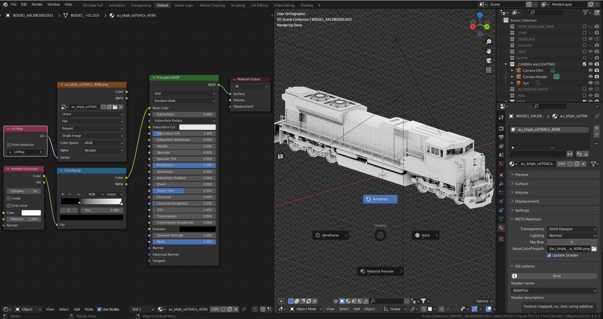
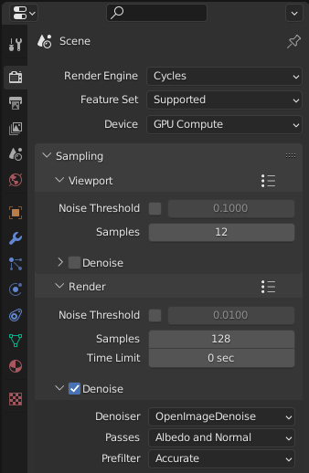
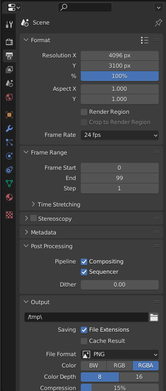
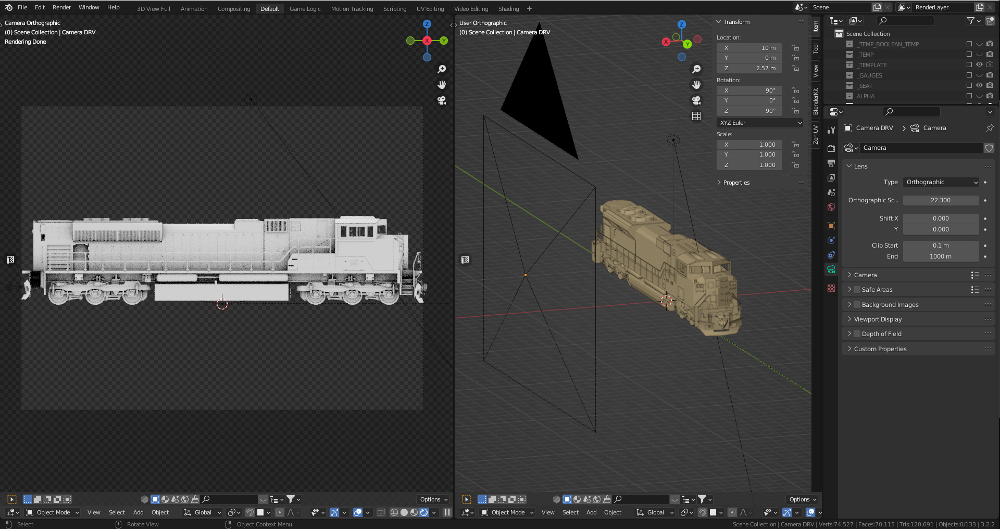
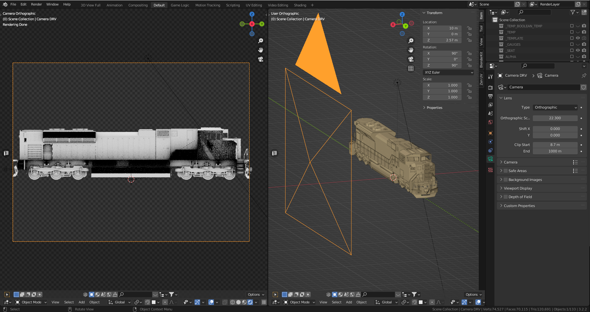
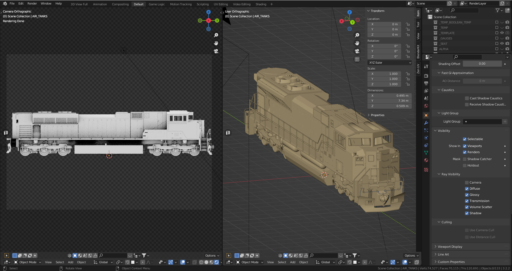
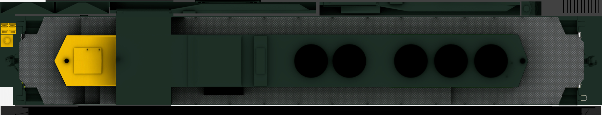

== How to Make Night / Snow Textures

(((Texture, Seasonal)))
Night textures on shapes are created by editing the original texture,
darkening it and perhaps adding a couple of touches for effect.

The night textures take effect at a predetermined time within the game
environment, so as to replicate a real world environment. The
extshape.dat file must be updated with the correct parameters so that
the shape is declared as having night textures (see the “How to write a
.ref file” document for further clarification). ((( Reference File)))

Once created, the night and day textures must have the same filename so
that the code can pick up the correct texture. This means that the
daytime / normal texture must be entered into the normal route textures
directory and the night version into the route night textures directory.

Below are two textures taken from the Orient Express level. These were
manipulated in a two dimensional drawing package:

image::images/image1.jpeg[]

image::images/image2.jpeg[]

image::images/image3.jpeg[]

image::images/image4.jpeg[]

This means that the texture on the left will be replaced with the
texture on the right once the correct night timing has been switched on.

(((Texture, Snow)))
Snow textures must also be created, so that your buildings and other
objects will look correct when there is snow lying on the ground. These,
too, are created using the original, daytime textures. The extshape.dat
file must be updated in relation to this (see the “How to write a .ref
file” document for further clarification) and must be placed in the
route’s snow textures directory accordingly. The snow texture will only
be used when the snow environment settings have been switched on through
the Drive a Train User Interface.

Below are the snow versions of the textures above.

image::images/image1.jpeg[]

image::images/image5.jpeg[]

image::images/image3.jpeg[]

image::images/image6.jpeg[]

== Creating Shadows

(((Texture, Ambient Occlusion)))

Ambient Occlusion is the generation of hard-coded or `baked` shadows instead of relying in dymanic lighting to generate shadows for an in-game asset.  It provides extra depth to an asset that would not be achieved otherwise.

Marek on Elvas Tower shared how he achieves ambient occlusion on his models and it is shared here.  

[NOTE]
Your model needs to be UV UNWRAPPED prior to baking out an {AO} image as described here.

An orthographic camera can be used to render the ambient Occlusion with all projection planes. Clipping planes can then be used on the camera to make certain parts invisible to the render camera, which helps exclude details that are not desired. The renders can then be imported into GIMP (or any other editor that supports layers) and used as the base for the final texture layout. The model can then be unwrapped to that. Livery colors can then be added in layers above the {AO} layers and layer blend modes can be used to create the desired image. This method is more time-consuming than other methods, but it produces results that are far better than what can be achieved by hand in 2D alone.

The image above shows a model with a single material applied to it called `au_bhpb_sd70ace_4096`. In the shader editor, two inputs can be chosen for the Base Color of the `Principled BSDF:` either an image file applied to the model at the top or an {AO} shader via a Color Ramp node below it. When exporting to `.S` or wanting to view the texture in Blender, the `texture node` needs to be plugged in, and when rendering the {AO}, the {AO} Shader needs to be plugged in. By setting the 3D viewer to `Rendered`, one can get an idea of what the output will look like and can adjust the shadow effect via the sliders in the ColorRamp.

In the Render properties tab, switch your Render Engine to Cycles and your Device to GPU Compute for faster rendering. With a Render sample setting of 128, rendering can take a while on a PC. To get a faster render time when testing, try using a lower number initially. Don't forget to turn on `Denoise` to give you a cleanly rendered image.

In the Output properties tab,  the  `Format Resolution X = 4096 px` is used because there is a 4K texture being used on the model. You can adjust the Resolution Y value later when you know how much vertical space the render will take (see below).

A camera should be added to the scene and moved to the side of the locomotive. The Rotation values in the Properties tab should be used to ensure that it is perpendicular to the locomotive. On the Object Data Properties tab, the Type of Camera should be changed to Orthographic. A separate 3D viewport should be opened and the Camera should be selected and kbd:[CTRL + Num 0] should be pressed to get a side view of the locomotive from the camera's point of view. If it is not already in Rendered view, pressing kbd:[Z] should allow for Rendered view to be selected; the {AO} shader should be visible in the camera view. 

The Orthographic Scale should be adjusted for the camera so that the entire length of the locomotive body fills the camera view (for this locomotive, the scale is 22.300). The camera should be moved in the `Y` and `Z` axes to ensure that it is in frame. Then, the `Format Resolution Y = value` should be adjusted so that no empty space is rendered above and below the locomotive. When the entire locomotive is framed in the camera view, kbd:[F12] should be pressed and Blender will render the {AO} into a new window.

If denoise is enabled, the rendering may appear to hang, but it will complete after a while. Making multiple copies of the camera and moving them to the sides, ends, top and bottom is recommended in order to render the {AO} from the different projections. Keeping the `Orthographic Scale` the same on all the cameras will result in the render being at the same textural density. Additionally, unlike a perspective camera, the distance of the camera from the object does not change the size of the resultant render.

Once you have finished rendering the image, you can save it to your computer and import it into your 2D graphics program to use as a base for your texture. To make sure the texture has the same textural density, you should make multiple copies of the camera and move them to the sides, ends, top and bottom. Again, unlike with a perspective camera, the distance of the camera from the object will not affect the size of the render. However, the hand rails may obstruct the details on the body behind. To fix this, you have multiple options.

In the image above the `X` location of the camera is 10m to the side of the locomotive.  The `Clip Start` distance has been changed from its default value of 0.1m to 8.7m. When rendered, the view no longer includes the handrails but displays the side of the body as the camera is drawing what it can see from 8.7m to 1000m, beyond the hand rail closest to the camera. This clipping results in the cab side, fuel tank and air tanks being cut off. The same outcome can be achieved by keeping the `Clip Start` and `End` at their default settings and moving the camera in the `X` direction, allowing for 'slices' of the scene similar to an MRI machine.

It is possible to make parts invisible to the render camera. In the image, the `Camera` checkbox in the Object Properties tab for the hand rails and air tank objects has been unchecked. This results in the entire side of the locomotive body being visible in the render view, but the handrails and air tanks not being rendered. These methods can be used to exclude objects in the foreground that are not required for the desired image.

The {AO} can be rendered for all the different views and then mashed together in a 2D graphics program to export as the `au_bhpb_sd70ace_4096` texture to use for unwrapping and in Open Rails.

This technique for Baking {AO} is a good way to get the added shadow details on a texture but the method described here is not the only way to accomplish {AO} shadows.  It might not be the most effcient way either, but it seems to work.

[NOTE]
It is important to be aware that any lights in the scene, including environment lighting, will impact the rendered {AO}. Lights are not used when baking an {AO}, so if the rendered {AO} image is too dark, the environment brightness can be increased or area lights can be added, typically the length of the locomotive, placed on either side to minimize shadow casting. If the lighting is changed later on, this will impact subsequent renders and will not match earlier renders. It is essential to be aware of this.

